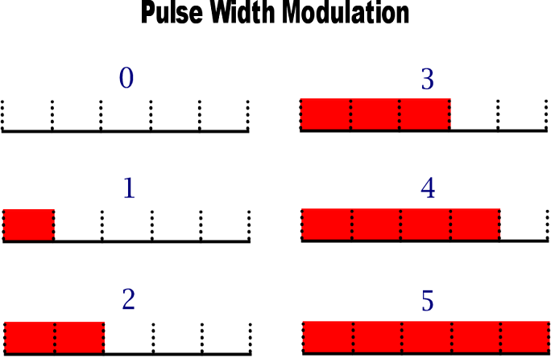
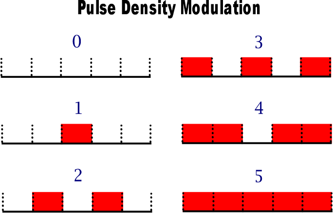

# PULSE DENSITY MODULATION, 12-bit DAC using CH32X035.

This is a demo for generating a good quality analog signal from an interpolated 12 bit sample data, 
using a bit stream clocked at 1.371MHz, with the assistance of the Programable IO controller (a slave 8-bit core) 
inside the 32 bit RISC-V CH32X035. A PWM wave using DMA and Channel 1 of the Timer 1 is also generated for
comparison. Also demonstrates that both peripherals can coexist generating several analog signals, while most
of the processing time of the main core is spend blinking an LED.

## Description

Pulse Density Modulation (PDM) has some advantages over Pulse Width Modulation (PWM) because it shifts the unwanted
frequency components to the high spectrum, making the removal of such frequencies very easy. Since decades, 
microcontrollers have had the capability of generating PWM signals leveraging the several timer peripherals that are
commonly available. Generating PWM is a simple matter, just count from 0 to the full range, creating N time slots or
clock pulses, then for every slot, if the counter is below a reference value, then the device outputs a certain 
logic level, while the time slots where the counter is above (or equal) such reference, then the device output the 
respective negated logic level.




The equivalent analog level is rebuilt by using an integrator, but it can be done as simple as a passive low pass filter
consisting in a RC network. Thus, the result is an analog level that represents the DC average level at the pulse and is
directly proporcional to Ton/(Ton+Toff) also known as Duty Cycle. We remember that every pulse period is divided in N time
slots. If this N is a power of 2, you get a resolution in bits of Log2(N).

Really, as long as the "Ton" slots are present in a whole pulse, no matter where they are located, you can rebuild the 
equivalent analog signial. Hence if we distribute evenly those Ton slots by interleaving with the Toff slots, you can 
use the same integrator filter but you get some advantages... Because the input signal is more frequently changing, the
filter can effectively remove out those changes more easily, yielding to a better output analog signal or the need of a
much lesser complex filtering (this is important when amplyfing in power the pulsed signal because we are dealing with
very low impedances, so the integrator filters must be done with huge inductances and capacitances... Here is where PDM
comes into play.



PDM is often used in Sigma-Delta modulators that are often used as Analog to Digital Converters, in these, a comparator that
serves as 1-bit ADC creates a clocked signal that, once integrated into an analog reference and substracted (delta), generates
an error signal for the next comparation. Then the 1 bit stream is used for a Capture Channel in order to count the number
of pulses in a certain period, decimating a 1 bit high frequency signal into a lower bitrate but more with more bit-depth.

Inexplicably, although PDM ADCs using counters are trivial for a MCU, DACs using PDM aren't as frequently implemented via 
hardware inside a MCU due to the lack of simple peripherals that yield to a high rate bitstream, because of that, programmers 
must rely to the less efficient PWM technique.  

[Delta Sigma Modulation at Wikipedia](https://en.wikipedia.org/wiki/Delta-sigma_modulation)

Here I leverage the capability of the PIOC preripheral in a CH32X035 by creating a moderate high frequency bitstream of 1.371MHz
that can be utilized to create a 12 bit signal of a relatively yet useful low sample rate.

Of course, because de PDM algorythm is so simple (comprised of just adders-substractors and shadow registers), if such device
could be implemented via hardware, then the bit stream generated would be clocked at 1 cycle of the main processor. Here in this
code, the PDM is clocked every mcu 35 cycles. because 

## Getting Started

### Dependencies

* Describe any prerequisites, libraries, OS version, etc., needed before installing program.
* ex. Windows 10

### Installing

* How/where to download your program
* Any modifications needed to be made to files/folders

### Executing program

* How to run the program
* Step-by-step bullets
```
code blocks for commands
```

## Help

Any advise for common problems or issues.
```
command to run if program contains helper info
```

## Authors

Contributors names and contact info

ex. Dominique Pizzie  
ex. [@DomPizzie](https://twitter.com/dompizzie)

## Version History

* 0.2
    * Various bug fixes and optimizations
    * See [commit change]() or See [release history]()
* 0.1
    * Initial Release

## License

This project is licensed under the [NAME HERE] License - see the LICENSE.md file for details

## Acknowledgments

Inspiration, code snippets, etc.
* [awesome-readme](https://github.com/matiassingers/awesome-readme)
* [PurpleBooth](https://gist.github.com/PurpleBooth/109311bb0361f32d87a2)
* [dbader](https://github.com/dbader/readme-template)
* [zenorocha](https://gist.github.com/zenorocha/4526327)
* [fvcproductions](https://gist.github.com/fvcproductions/1bfc2d4aecb01a834b46)
