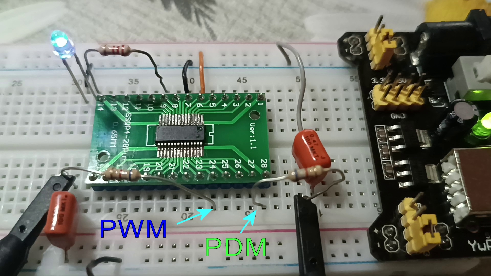
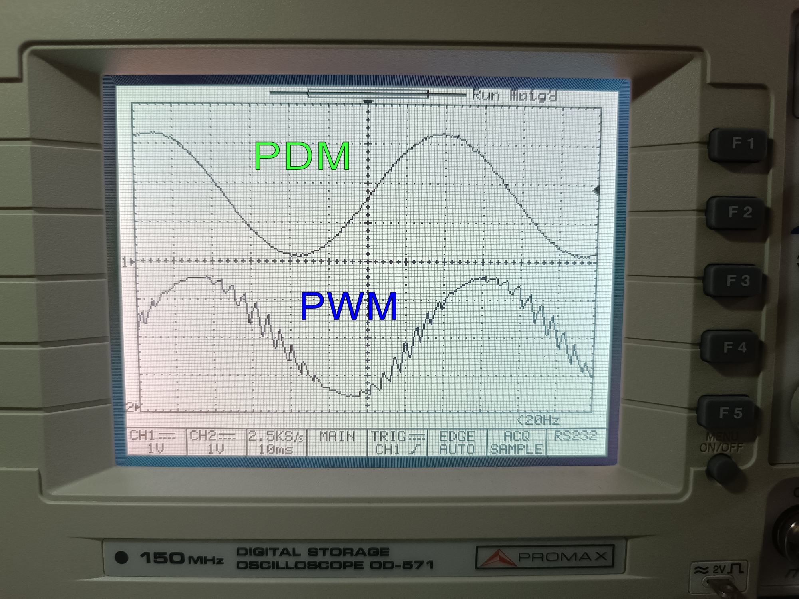
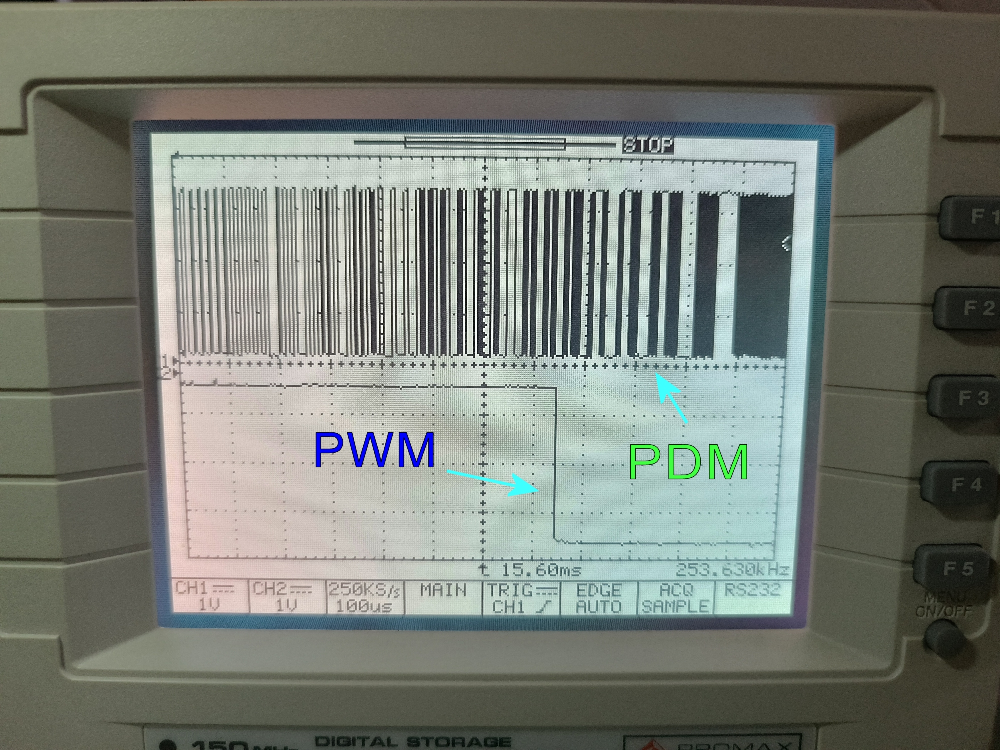
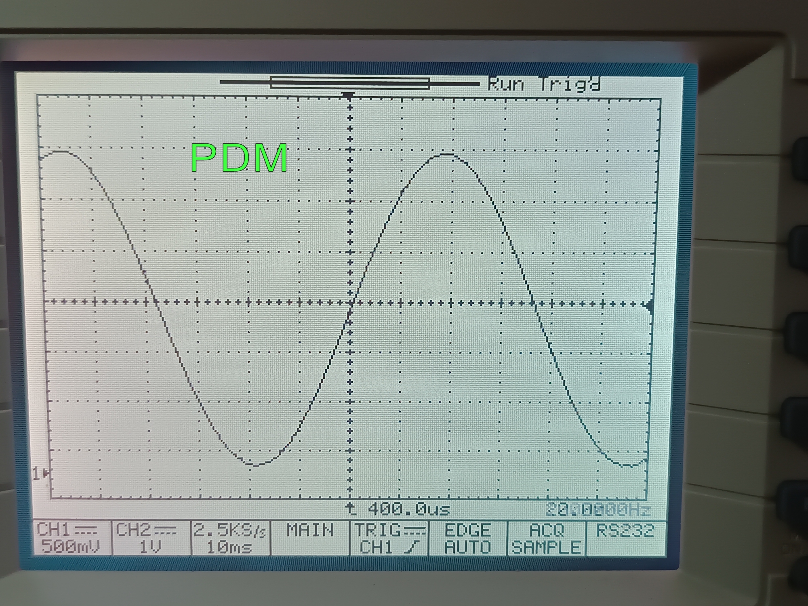
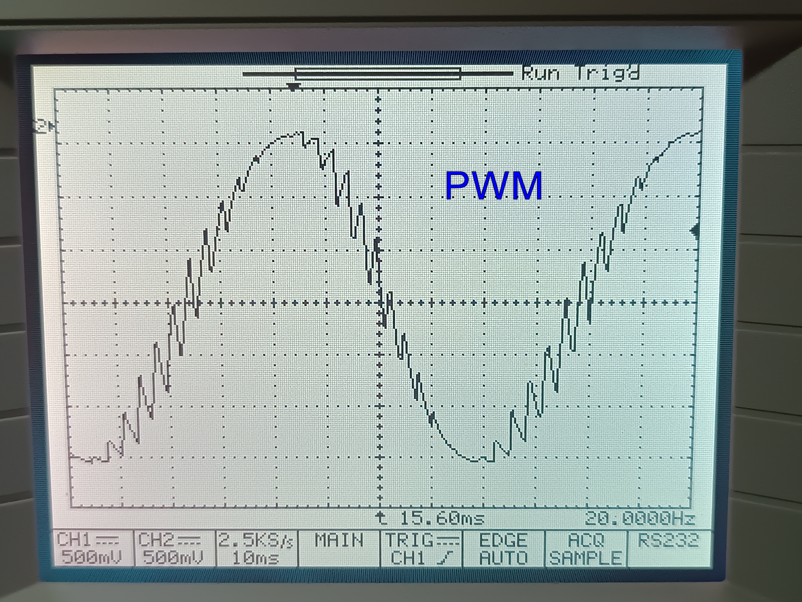
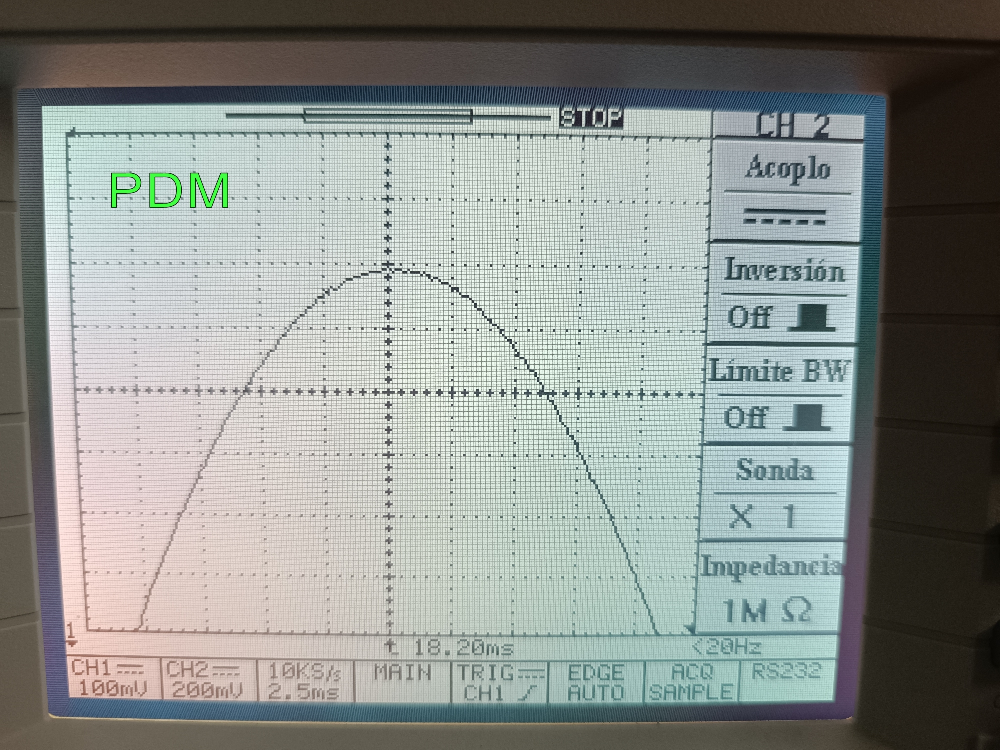

# PULSE DENSITY MODULATION, 12-bit DAC using CH32X035.

This is a demo for generating a good quality analog signal from an interpolated 12 bit sample data, 
using a bit stream clocked at 1.371MHz, with the assistance of the Programable IO controller (a slave 8-bit core) 
inside the 32 bit RISC-V CH32X035. A PWM wave using DMA and Channel 1 of the Timer 1 is also generated for
comparison. Also demonstrates that both peripherals can coexist generating several analog signals, while most
of the processing time of the main core is spend blinking an LED.

## Description

Pulse Density Modulation (PDM) has some advantages over Pulse Width Modulation (PWM) because it shifts the unwanted
frequency components to the high spectrum, making the removal of such frequencies very easy. Since decades, 
microcontrollers have had the capability of generating PWM signals leveraging the several timer peripherals that are
commonly available. Generating PWM is a simple matter, just count from 0 to the full range, creating N time slots or
clock pulses, then for every slot, if the counter is below a reference value, then the device outputs a certain 
logic level, while the time slots where the counter is above (or equal) such reference, then the device output the 
respective negated logic level.


The equivalent analog level is rebuilt by using an integrator, but it can be done as simple as a passive low pass filter
consisting in a RC network. Thus, the result is an analog level that represents the DC average level at the pulse and is
directly proporcional to Ton/(Ton+Toff) also known as Duty Cycle. We remember that every pulse period is divided in N time
slots. If this N is a power of 2, you get a resolution in bits of Log2(N).

Really, as long as the "Ton" slots are present in a whole pulse, no matter where they are located, you can rebuild the 
equivalent analog signial. Hence if we distribute evenly those Ton slots by interleaving with the Toff slots, you can 
use the same integrator filter but you get some advantages... Because the input signal is more frequently changing, the
filter can effectively remove out those changes more easily, yielding to a better output analog signal or the need of a
much lesser complex filtering (this is important when amplyfing in power the pulsed signal because we are dealing with
very low impedances, so the integrator filters must be done with huge inductances and capacitances... Here is where PDM
comes into play.


PDM is often used in Sigma-Delta modulators that are often used as Analog to Digital Converters, in these, a comparator that
serves as 1-bit ADC creates a clocked signal that, once integrated into an analog reference and substracted (delta), generates
an error signal for the next comparation. Then the 1 bit stream is used for a Capture Channel in order to count the number
of pulses in a certain period, decimating a 1 bit high frequency signal into a lower bitrate but more with more bit-depth.

Inexplicably, although PDM ADCs using counters are trivial for a MCU, DACs using PDM aren't as frequently implemented via 
hardware inside a MCU due to the lack of simple peripherals that yield to a high rate bitstream, because of that, programmers 
must rely to the less efficient PWM technique.  

[Delta Sigma Modulation at Wikipedia](https://en.wikipedia.org/wiki/Delta-sigma_modulation)

Here I leverage the capability of the PIOC preripheral in a CH32X035 by creating a moderate high frequency bitstream of 1.371MHz
(48/35) that can be utilized to create a 12 bit signal of a relatively yet useful low sample rate.

Of course, because de PDM algorythm is so simple (comprised of just adders-substractors and shadow registers), if such device
could be implemented via hardware, then the bit stream generated would be clocked at 1 cycle of the main processor. Here in this
code, the PDM is clocked out every 35 mcu cycles. The master clock in the CH32X035 is of 48Mhz.

### The PDM algorythm

The PDM algorythm is very easy to understand. I will leave the demonstration to the reader, but it consists of this C pseudocode...
```
int i, accumulator=0;
while(new(input){
   for (i=0; i<Range; i++){
                      accumulator = accumulator + input;
                      if (accumulator>=Range) {
                                 output(high);
                                 accumulator = accumulator - Range;
                       } else output(low);
   }
}
```  

Due to the properties of modulo operator (the substraction shown above is just an easy way to get the remainder of quotient 1), 
after "Range" times has passed, the state of the accumulator is equal to the initial state (because there is the "Range" modulo of the
product of any input value by the Range. By the [Pigeonhole principle](https://en.wikipedia.org/wiki/Pigeonhole_principle), one can 
demonstrate that the output goes high exactly the same amount of times the value of the input, and those pulses are evenly distributed
across the full range. That is, we got our PDM ready.

If Range is a power of 2, for example, 2^12, then we can implement the modulo operator by bitmasking, or just resetting the bit outside the range. Then the
steps for creating our PDM are:

1. We add the value of interest to the 12 bits accumulator
2. Then we see if such accumulator has overflown
3. Output the overflow condition (also known as carry flag)
4. Repeat step 1 for a total amout of 2^12 times.

### The linear Interpolation

Until now, we are sampling with fixed values every fixed sample period. Then we are creating a stepped analog signal such as this one...


One of the advantages in PDM is that we have full control of every time slot, and every sample period is comprised of 2^12 time slots.
We can make the "input" parameter dependent of the n'th slot in sequence, that is, I(n). The simplest yet powerfull manner of
achieving this is just connecting every two samples with a stright line, hence the name of "Linear interpolation".


If we have two samples, Sample[0] and Sample[1], and we have 2^12 steps, that is, 4096 time slots, then we can trace a stright line by simply using the explicit equatinon of a line:

I(n)=Sample[0]+n*(Sample[1]-Sample[0])/4096. 

After 4096 steps, we have that I(4096) = Sample[0] + Sample[1] - Sample[0] = Sample[1].

There is a division that leads to noninteger values, but we can get rid of such division by scaling everything by 4096
The final equation is I(n) * 4096 = Sample[0] * 4096 + n * (Sample[1] - Sample [0]). The 4096 factor is achieved by shifting 12 bit in the accumulator, 
that is, treating the I(n) and Accumulator as 24 bits registers, and getting out the 24th bit carry instead of the 12 bit one.

That's all, we've got a linear interpolated 12 bit resolution PDM DAC.

### Results...

Here are some pictures of this demo. Both outputs, PDM and PWM use the same low pass filtering comprised of a 6800 ohm resistor and a 470nF capacitor.

The setup:



Both generated sine waves displayed in my oscilloscope.



A close up of the generated bitstreams...



A view of one cycle of the generated wave in PDM.



The same with the PWM signal.



A close up of the crest of the wave generated by PDM. Notice that the integration filter even smooths out the linear corners, yielding a very soft curve.



## Getting Started

### Dependencies

* A development board, or as I did, put the CH32X035 MCU into an adapter (be careful because TSSOP adapters do not fit exactly the QSOP-28 footprint).
* A proper programmer (Ex. WCH-LinkE).

### Installing

* Just import the project into the MounRiver Studio.

## WARNING

Be sure that the linker script gives 16kB of ram to the main MCU. If has the whole 20kB assigned, then the code will perform a hardfault when enabling the slave core.
The link.ld file must be like this...

```
[...]
MEMORY
{  
	FLASH (rx) : ORIGIN = 0x00000000, LENGTH = 62K
	RAM (xrw) : ORIGIN = 0x20000000, LENGTH = 16K
}
[...]
```

## Authors

Mario Javier Burriel Valencia.

## Version History

* 0.1
    * Initial Release

